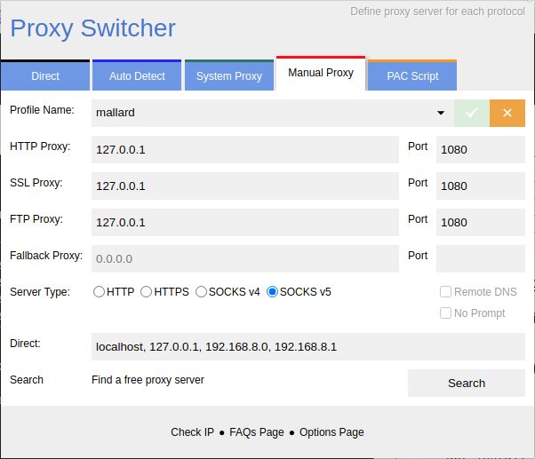

# Http Injector Python

Bypass ISP firewalls Browse the internet through ssh tunnel


## How it works

This script tricks your isp into thinking you are using a special data pack (ex: teams.microsoft.com)
and allows you to browse any website using that pack
  
## Special thanks to

This project is a modified version of the following project. make sure to check their project.
 - [abdoxfox/http-ssl-ssh-injector](https://github.com/abdoxfox/http-ssl-ssh-injector)
 
  
## Disclaimer
I'm not responsible for anything you do with this

## How To use

There are two ways to run this

- Run the executables (Recommended)
- Run from source code

## Running from Executables

### Installing Dependancies

First install these dependancies

```bash
  sshpass
  netcat-openbsd
  corkscrew
  nc
```

Use `sudo apt install <package>` for Debian based distros and use `sudo pacman -S <package>` for Arch based distros

Modify the settings.ini file according to your needs

### How to configure settings.ini file

Run the **HTTP Config Editor** and edit the settings.

### How to use

Run **http_injector** in terminal
<span style="color: red;">Warning: Do not run http_Injector by double clicking it!</span>
```bash
cd /path/to/http/injector/folder/
chmod +x ./http_Injector
./htto_Injector
```

Install [Proxy Switcher](https://add0n.com/proxy-switcher.html) extension on you Browser and choose the following settings




## Running from Source Code

Use this method if the above method doesent work

### Installing Dependancies

First install these dependancies

```bash
  sshpass
  netcat-openbsd
  corkscrew
  nc
  python3
```

open terminal and run **http_Injector.py** python file
```bash
python3 http_Injector.py
```
### How to switch between SSH and SSL mode

open the `ssh.py` file and goto **line 34**
then change the variable according to following

- SSH mode: `arg = '1'`
- SSL mode: `arg = '2'`

